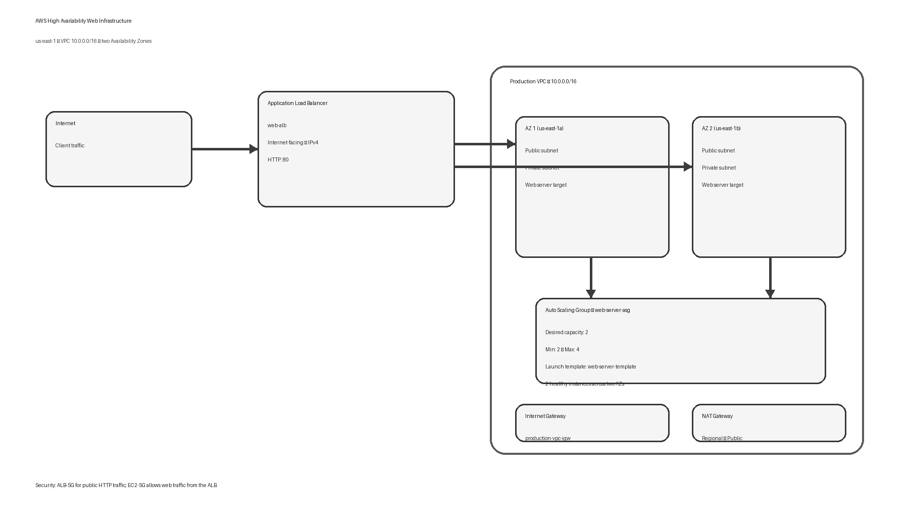

# AWS High Availability Web Infrastructure

A hands-on AWS infrastructure project focused on networking, load balancing, Auto Scaling, and high availability.

## Project Overview

I built this environment in AWS to run a simple web application across multiple Availability Zones instead of relying on a single web server.

The main path is:

**Internet → Application Load Balancer → Web server targets**

The environment uses an Auto Scaling Group to maintain the web-server capacity and places the workload across two Availability Zones in `us-east-1`.

## Architecture

### Main components

- Amazon VPC — `10.0.0.0/16`
- Two Availability Zones
  - `us-east-1a`
  - `us-east-1b`
- Public and private subnets
- Internet Gateway
- NAT Gateway
- Application Load Balancer
- Target Group
- EC2 web servers
- Auto Scaling Group
- Launch Template
- Security Groups

## Current Configuration

### VPC and Networking

The project uses a custom VPC named `production-vpc-vpc` with CIDR `10.0.0.0/16`.

The subnet layout includes public and private subnets across two Availability Zones. Separate route tables are used for the private subnets.

The environment also has:

- An Internet Gateway attached to the production VPC
- A public NAT Gateway
- Separate private route tables for the private subnets

## Load Balancing

I created an internet-facing Application Load Balancer named `web-alb`.

The load balancer listens on **HTTP port 80** and forwards requests to the `web-servers-tg` target group.

### Target Group

The target group is named `web-servers-tg`.

Configuration visible in the AWS console:

- Target type: Instance
- Protocol: HTTP
- Port: 80
- Registered targets: 2
- Healthy targets: 2
- Unhealthy targets: 0

The two healthy targets are distributed across:

- `us-east-1a`
- `us-east-1b`

## Auto Scaling

The Auto Scaling Group is named `web-server-asg`.

Current configuration shown in the AWS console:

- Desired capacity: 2
- Minimum capacity: 2
- Maximum capacity: 4
- Current instances: 2
- Instance health: 2/2 healthy
- Launch template: `web-server-template`

The Auto Scaling Group uses two Availability Zones:

- `us-east-1a`
- `us-east-1b`

## Security Groups

I separated the security controls for the load balancer and the EC2 web servers.

### ALB-SG

The ALB security group is used for HTTP traffic to the Application Load Balancer.

### EC2-SG

The EC2 security group is configured to allow web traffic from the load balancer rather than exposing the web servers directly to the public internet.

## Live Demo

The application is currently reachable through the Application Load Balancer:

**http://web-alb-611314923.us-east-1.elb.amazonaws.com/**

The page displays the hostname of the web server handling the request. This makes it possible to see that requests are being served by the backend instances behind the load balancer.

## How the Request Flows

1. A client sends an HTTP request to the public ALB DNS name.
2. The Application Load Balancer receives the request on port 80.
3. The ALB forwards the request to the `web-servers-tg` target group.
4. The target group selects a healthy EC2 instance.
5. The web server returns the response.
6. The response is returned through the ALB to the client.

## High Availability Design

The web-server layer is spread across two Availability Zones.

The load balancer also uses two Availability Zones, while the Auto Scaling Group maintains two running instances at the current desired capacity.

This design avoids making one EC2 instance the only backend for the application.

## What I Practiced

Through this project I worked with:

- VPC design
- CIDR planning
- Public and private subnet design
- Route tables
- Internet Gateway
- NAT Gateway
- Application Load Balancer
- Target Groups
- EC2
- Auto Scaling Groups
- Launch Templates
- Security Groups
- Availability Zones
- Basic high-availability architecture
- Deploying and testing a live web application

## Project Screenshots

All screenshots in this repository were captured from the AWS environment used for this project. Resource IDs and account-specific identifiers have been redacted where appropriate for a public GitHub repository.

## Future Improvements

Possible next steps for this project:

- Add HTTPS with an ACM certificate
- Add Route 53 DNS
- Add CloudWatch alarms and dashboards
- Add a stronger automated scaling policy
- Add Infrastructure as Code with Terraform
- Add a CI/CD deployment pipeline
- Improve the web application beyond the current test page

## Notes

This repository documents the infrastructure that I actually built and tested in AWS. Configuration details that are not shown in the screenshots are intentionally not claimed here.

